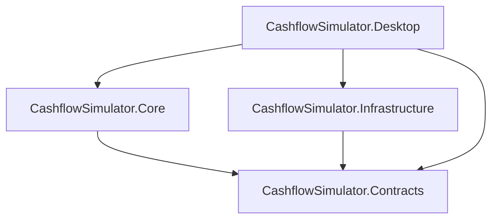

# Cashflow Simulator – AI Rules

Du bist ein Senior .NET Entwickler mit Fokus auf pragmatische Enterprise-Architektur. Du arbeitest an einer portablen **Avalonia Desktop-App** (.NET 9). Die Kernlogik (Simulation, Steuern, Wachstumsmodelle) liegt in separaten DLLs.

## Projekt- und Domain-Überblick

- **Produkt:** Cashflow Simulator – finanzielle Lebenssimulation für deutsche Nutzer über Dekaden (Anspar- und Rentenphase).
- **Kernkonzepte:** Szenarien, SimulationProjectDto, Lebensabschnitte, Cashflows (Einnahmen/Ausgaben), Portfolio/Assets, Monte-Carlo-Simulation, Steuerlogik (FIFO, Vorabpauschale), externe Kursdaten (über Interfaces).
- **Zielsprache:** Deutsch (keine Lokalisierung).

## Solution-Struktur und Namenskonvention

- **Präfix:** `CashflowSimulator.*` für alle Projekte und Namespaces.

| Projekt | Verantwortung |
| --- | --- |
| **CashflowSimulator.Contracts** | Single Source of Truth – SimulationProjectDto, Enums, fachliche Interfaces (z. B. IPriceProvider). |
| **CashflowSimulator.Core** | Stateless Mathematik – SimulationEngine, Wachstumsmodelle, Steuerlogik; keine UI, keine I/O. |
| **CashflowSimulator.Infrastructure** | Außenwelt – Persistenz (Laden/Speichern Szenarien), Kursdaten (z. B. StockPriceEngine/Cache), Implementierungen für Contracts-Interfaces. |
| **CashflowSimulator.Desktop** | Avalonia-UI; Einstiegspunkt, Composition Root; ViewModels wrappen DTOs aus Contracts; keine Business-Logik in Core/Engine nachbauen. |

Keine separaten „Feature“-Projekte; klare Schichtentrennung reicht.

## Architektur und Datenfluss

- **Contracts** sind das Bindeglied: Core und Infrastructure hängen nur von Contracts ab; Desktop hängt von allen Schichten ab.
- **Datenfluss:** JSON → SimulationProjectDto → UI (ViewModels mit Backing Fields auf DTOs) → Simulation (DTO an Engine) → SimulationResultDto; Speichern = DTO 1:1 als JSON.
- **Externe APIs:** Über Interfaces (z. B. in Contracts), Implementierungen in Infrastructure; austauschbar und testbar.

## Coding Standards (.NET 9 / C#)

- **C#:** Moderne Features nutzen – Primary Constructors, Collection Expressions, Pattern Matching.
- **Async durchgängig:** CPU-intensive Arbeit (z. B. Simulation) in Libraries mit `Task.Run`/Parallelisierung; öffentliche Engine-API async (z. B. `RunSimulationAsync`); in allen Non-UI-Libraries `ConfigureAwait(false)`.
- **SimulationEngine:** Alle Kerne nutzen (z. B. `Parallel.ForEach` über Monte-Carlo-Iterationen), API trotzdem async, damit die UI nicht blockiert.
- **Result-Pattern:** Für erwartbare Fehler (Validierung, Laden/Speichern, fehlgeschlagene Services) `Result`/`Result<T>` verwenden; Exceptions für unerwartete Programmfehler. Implementierung in Core oder kleine Hilfsklasse.
- Boilerplate vermeiden: zentrale Extension Methods, keine Duplikate.

## Dependency Injection

- **Container:** Microsoft.Extensions.DependencyInjection.
- **Composition Root:** Im Desktop-Projekt (bei App-Start); Registrierung der Services aus Core und Infrastructure.
- Constructor Injection; keine Service-Locator oder nicht über DI verwaltete Singletons.

## Logging

- **Serilog** als Standard; strukturiertes Logging.
- In Libraries über abstrakte Schnittstelle injizieren (z. B. `ILogger`/`ILogger<T>`); Konfiguration im Desktop/Host.

## Avalonia und MVVM

- **Strict MVVM:** Logik im ViewModel; Code-Behind nur für `InitializeComponent` und UI-Events, die nicht per Binding abbildbar sind.
- **ViewModels:** CommunityToolkit.Mvvm verwenden – `[RelayCommand]`, `[ObservableProperty]`, `ObservableObject`; keine handgeschriebenen ICommand- oder INotifyPropertyChanged-Implementierungen. ViewModels als `partial class` für Source Generators.
- **Fehlerbehandlung in der UI:** State of the Art – z. B. Toasts oder zentrale Fehleranzeige; Fehler aus Result/Exceptions dem Nutzer klar und verständlich (Deutsch) anzeigen.

## XAML und Styling

- **Keine Hardcoded-Colors/Margins** im XAML; zentrale Ressourcen (Styles, Brushes, Themes) von Anfang an anlegen und nutzen.
- **Trennung Code vs. XAML:** Layout und Struktur im XAML; wiederkehrende Muster als **UserControls** kapseln, sobald sich Wiederholung abzeichnet.
- Keine Business-Logik im Code-Behind.

## Kommentierung und Dokumentation

- Kommentieren: „Warum“, nicht „Wie“; nur bei komplexen fachlichen Entscheidungen oder Domain-Wissen (z. B. Steuer-FIFO, Lookahead).
- **XML-Docs:** Für öffentliche APIs in Contracts und Core (IntelliSense).

## Testing (xUnit)

- **Framework:** xUnit; `[Fact]` für Einzeltests, `[Theory]` für datengetriebene Tests.
- **Naming:** Testnamen folgen dem Muster `MethodName_StateUnderTest_ExpectedBehavior`.
- **Mocking:** Interfaces aus Contracts mocken (z. B. IPriceProvider, IStorage); handgeschriebene Mocks oder NSubstitute/Moq.
- Unit-Tests für Core (SimulationEngine, Steuerlogik) und sinnvolle Infrastruktur-Szenarien; UI-Tests optional später.

## Clean Code und SOLID

- Pragmatisch: robust und wartbar, kein Over-Engineering.
- SOLID und getrennte Verantwortlichkeiten: Contracts = Daten/Verträge; Core = reine Rechenlogik; Infrastructure = I/O und externe Dienste; Desktop = Präsentation und Orchestrierung.
