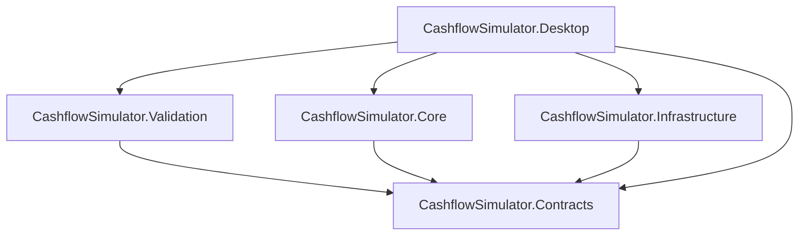

# Cashflow Simulator – AI Rules

Du bist ein Senior .NET Entwickler mit Fokus auf pragmatische Enterprise-Architektur. Du arbeitest an einer portablen **Avalonia Desktop-App** (.NET 9). Die Kernlogik (Simulation, Steuern, Wachstumsmodelle) liegt in separaten DLLs.

## Projekt- und Domain-Überblick

- **Produkt:** Cashflow Simulator – finanzielle Lebenssimulation für deutsche Nutzer über Dekaden (Anspar- und Rentenphase).
- **Kernkonzepte:** Szenarien, SimulationProjectDto, Lebensabschnitte, Cashflows (Einnahmen/Ausgaben), Portfolio/Assets, Monte-Carlo-Simulation, Steuerlogik (FIFO, Vorabpauschale), externe Kursdaten (über Interfaces).
- **Zielsprache:** Deutsch (keine Lokalisierung).

## Solution-Struktur und Namenskonvention

- **Präfix:** `CashflowSimulator.*` für alle Projekte und Namespaces.

| Projekt | Verantwortung |
| --- | --- |
| **CashflowSimulator.Contracts** | Single Source of Truth – SimulationProjectDto, Enums, fachliche Interfaces (z. B. IPriceProvider), ValidationError/ValidationResult. |
| **CashflowSimulator.Validation** | FluentValidation-Validatoren für DTOs (SimulationParametersDto, MetaDto, SimulationProjectDto); Single Source of Truth für fachliche Regeln. |
| **CashflowSimulator.Core** | Stateless Mathematik – SimulationEngine, Wachstumsmodelle, Steuerlogik; keine UI, keine I/O. |
| **CashflowSimulator.Infrastructure** | Außenwelt – Persistenz (Laden/Speichern Szenarien), Kursdaten (z. B. StockPriceEngine/Cache), Implementierungen für Contracts-Interfaces. |
| **CashflowSimulator.Desktop** | Avalonia-UI; Einstiegspunkt, Composition Root; ViewModels wrappen DTOs aus Contracts; keine Business-Logik in Core/Engine nachbauen. |

Keine separaten „Feature“-Projekte; klare Schichtentrennung reicht.

## Architektur und Datenfluss

- **Contracts** sind das Bindeglied: Core und Infrastructure hängen nur von Contracts ab; Desktop hängt von allen Schichten ab.
- **Datenfluss:** JSON → SimulationProjectDto → UI (ViewModels mit Backing Fields auf DTOs) → Simulation (DTO an Engine) → SimulationResultDto; Speichern = DTO 1:1 als JSON.
- **Externe APIs:** Über Interfaces (z. B. in Contracts), Implementierungen in Infrastructure; austauschbar und testbar.

## Coding Standards (.NET 9 / C#)

- **C#:** Moderne Features nutzen – Primary Constructors, Collection Expressions, Pattern Matching.
- **Async durchgängig:** CPU-intensive Arbeit (z. B. Simulation) in Libraries mit `Task.Run`/Parallelisierung; öffentliche Engine-API async (z. B. `RunSimulationAsync`); in allen Non-UI-Libraries `ConfigureAwait(false)`.
- **SimulationEngine:** Alle Kerne nutzen (z. B. `Parallel.ForEach` über Monte-Carlo-Iterationen), API trotzdem async, damit die UI nicht blockiert.
- **Result-Pattern:** Für erwartbare Fehler (Validierung, Laden/Speichern, fehlgeschlagene Services) `Result`/`Result<T>` verwenden; Exceptions für unerwartete Programmfehler. Implementierung in Core oder kleine Hilfsklasse.
- Boilerplate vermeiden: zentrale Extension Methods, keine Duplikate.

## Dependency Injection

- **Container:** Microsoft.Extensions.DependencyInjection.
- **Composition Root:** Im Desktop-Projekt (bei App-Start); Registrierung der Services aus Core und Infrastructure.
- Constructor Injection; keine Service-Locator oder nicht über DI verwaltete Singletons.

## Logging

- **Serilog** als Standard; Konfiguration im Desktop-Host (`Program.Main`).
- In Libraries und ViewModels: **ILogger** / **ILogger&lt;T&gt;** per Constructor Injection; Konfiguration nur im Host.
- **Strukturiertes Logging:** Stets Platzhalter verwenden, keine String-Interpolation:
  - Richtig: `_logger.LogError("Fehler beim Laden der Datei '{Path}': {Error}", path, result.Error);`
  - Falsch: `_logger.LogError($"Fehler: {path}");` (nicht strukturiert, schlecht durchsuchbar).
- **Log-Datei:** Unter dem App-Basisverzeichnis in `Logs/cashflow-{Date}.log` (Rolling pro Tag); Format: `{Timestamp:yyyy-MM-dd HH:mm:ss.fff zzz} [{Level:u3}] {Message:lj}{NewLine}{Exception}`. Level z. B. INF, DBG, ERR, FTL.
- **Level-Nutzung:** `LogDebug` für detaillierte Ablauf-Infos, `LogInformation` für normale Meilensteine (z. B. „Projekt geladen“), `LogError` für erwartbare Fehler (z. B. Laden fehlgeschlagen), `LogCritical`/`Log.Fatal` für unerwartete Startup- oder App-Abstürze.
- **App-Start:** Beim Start `Log.Information("Application starting")`; bei Fehler im Startup `Log.Fatal(ex, "Application startup failed")` und Exception durchreichen. Spätere Erweiterungen (neue Features, Services) sollen dieses Muster beibehalten: strukturierte Platzhalter, passendes Level, ILogger injizieren.

## Validierung

- **Nur über Validatoren:** Alle fachlichen Regeln und Grenzen werden ausschließlich über FluentValidation im Projekt **CashflowSimulator.Validation** abgebildet (Single Source of Truth). Keine Validierung im XAML.
- **Keine Validierung im XAML:** In Views keine `Minimum`/`Maximum` zur fachlichen Regelung setzen; keine Inline-Validierung. XAML dient nur Darstellung und Eingabe-UX (z. B. Schrittweite `Increment`).
- **Desktop:** Feature-ViewModels erben von `ValidatingViewModelBase` (INotifyDataErrorInfo); Validierung über `ValidationRunner` bei Property-Änderung (debounced). **Fehler werden nur im rechten Info-Panel** des jeweiligen Feature-Bereichs angezeigt; die Anzeige unter den Controls ist per App-Styles (in ErrorTrayStyles.axaml) deaktiviert (DataValidationErrors.ErrorTemplate leer). Kein „Übernehmen“/„Verwerfen“; Auto-Save bei jeder Änderung (auch bei ungültigen Daten).
- **Engine:** Validiert eingehende `SimulationProjectDto` an den Einstiegspunkten (z. B. vor Simulation); bei Fehlern Result mit Validierungsfehlern zurückgeben.
- **Partielle Validierung:** Pro DTO eigener Validator (z. B. `SimulationParametersValidator`, `MetaDtoValidator`); `SimulationProjectValidator` bündelt sie. Die Desktop-App kann gezielt nur das gerade bearbeitete Teil-DTO validieren.
- **ViewModel/DTO-Namenskonvention (Coding Guidelines):**
  - ViewModel-Properties, die 1:1 Daten aus einem DTO repräsentieren, **müssen** exakt so heißen wie die zugehörige DTO-Property. Ausnahme: abweichende Semantik (z. B. Alter in Jahren im VM vs. Datum im DTO).
  - Das Mapping von Validierungsfehlern (DTO → VM) darf **keine** hardcodierten Property-Namen enthalten. Es muss `nameof(DtoType.Property)` für den Key und `nameof(VmProperty)` für den Value verwendet werden, um Refactoring-Sicherheit zu garantieren.

## Feature-Bereiche (Eckdaten, Einstellungen, Szenario)

Neue Feature-Bereiche, die wie Eckdaten/Einstellungen funktionieren, folgen diesem Muster:

- **Shell:** Keine Statusleiste. Content-Bereich nutzt die volle Höhe (eine Zeile); Platzhalter oder `ContentControl` für das aktuelle Feature-ViewModel.
- **Layout:** Feature-View verwendet **FeatureLayoutView** (Common/Controls) als Wurzel: links scrollbarer Inhalt, rechts **Info-Panel** (Hilfetext + Block „VALIDIERUNGSFEHLER“).
- **ViewModel:** Erbt von **ValidatingViewModelBase**; **HelpKeyPrefix** implementieren (abstrakte Property, z. B. `=> "Eckdaten"`); optional **PageHelpKey** im Konstruktor (Standard ist HelpKeyPrefix); **IHelpProvider** per Constructor Injection.
- **Hilfe:** An jedem relevanten Control **FocusHelpBehavior.HelpKey** (und ggf. **ErrorPropertyName**) setzen. Lookup im HelpProvider erfolgt als **HelpKeyPrefix.PropertyName** (eindeutig pro Feature). **FocusHelpBehavior** einmalig initialisieren (z. B. in MainWindow). Bei GotFocus wird ActiveHelpKey am ViewModel gesetzt; Titel/Beschreibung kommen aus dem HelpProvider.
- **Neues Feature:** Neuer Ordner unter `Features/<Name>/` mit View (UserControl, Wurzel = FeatureLayoutView) und ViewModel (ValidatingViewModelBase, PageHelpKey, IHelpProvider). Keine Statusleiste, keine Inline-Fehler unter den Controls.

## Avalonia und MVVM

- **Strict MVVM:** Logik im ViewModel; Code-Behind nur für `InitializeComponent` und UI-Events, die nicht per Binding abbildbar sind.
- **ViewModels:** CommunityToolkit.Mvvm verwenden – `[RelayCommand]`, `[ObservableProperty]`, `ObservableObject`; keine handgeschriebenen ICommand- oder INotifyPropertyChanged-Implementierungen. ViewModels als `partial class` für Source Generators.
- **Fehlerbehandlung in der UI:** State of the Art – z. B. Toasts oder zentrale Fehleranzeige; Fehler aus Result/Exceptions dem Nutzer klar und verständlich (Deutsch) anzeigen.

### CRUD-ViewModels (Master-Detail-Pattern)

Für Feature-ViewModels mit CRUD-Funktionalität (Create, Read, Update, Delete) und Master-Detail-Layout:

- **Basisklasse:** `CrudViewModelBase<TDto>` (erbt von `ValidatingViewModelBase`) für generische CRUD-Logik verwenden.
- **DTO-Anforderung:** Das DTO muss `IIdentifiable` implementieren (Property `Id`).
- **Abstrakte Methoden implementieren:**
  - `LoadItems()`: Lädt Items aus dem `ICurrentProjectService` (z. B. `current.Streams`).
  - `UpdateProject(items)`: Schreibt Items zurück in den Service (z. B. `UpdateStreams`).
  - `BuildDtoFromForm()`: Erstellt DTO aus Formularfeldern; `EditingId` ist gesetzt (null = neu).
  - `MapDtoToForm(dto)`: Befüllt Formularfelder aus DTO beim Auswählen eines Items.
  - `ClearFormCore()`: Leert Formular und setzt Standardwerte; `ClearValidationErrors()` aufrufen.
  - `ValidateDto(dto)`: Ruft `ValidationRunner.Validate(dto)` auf.
- **Optionale Hooks:**
  - `OnNewItemCreated()`: Wird nach New-Command aufgerufen (z. B. für Default-Werte).
  - `OnItemDeleted(deletedId)`: Wird nach Delete aufgerufen (z. B. zum Löschen von Referenzen in anderen Listen).
  - `OnProjectChanged(sender, e)`: Kann überschrieben werden (Standard: `RefreshItems()`), z. B. um Dropdown-Optionen zu aktualisieren.
- **Commands:** `SaveCommand`, `DeleteCommand`, `NewCommand` sind bereits in der Basisklasse implementiert.
- **Collections:** `Items` (ObservableCollection) und `SelectedItem` sind in der Basisklasse verfügbar.
- **Spezielle Anforderungen:**
  - Bei Type-Filterung (z. B. Income/Expense): In `UpdateProject` die gefilterte Liste mit Items des anderen Typs mergen.
  - Bei Suchfunktion: Eigene gefilterte Collection (z. B. `Assets`) pflegen und in `OnProjectChanged` aktualisieren.
- **Beispiele:** `CashflowStreamsViewModel`, `CashflowEventsViewModel`, `MarktdatenViewModel`, `AssetClassesViewModel`, `PortfolioViewModel`.

## XAML und Styling

- **Keine Hardcoded-Colors/Margins** im XAML; zentrale Ressourcen (Styles, Brushes, Themes) von Anfang an anlegen und nutzen.
- **Trennung Code vs. XAML:** Layout und Struktur im XAML; wiederkehrende Muster als **UserControls** kapseln, sobald sich Wiederholung abzeichnet.
- Keine Business-Logik im Code-Behind.

## Kommentierung und Dokumentation

- Kommentieren: „Warum“, nicht „Wie“; nur bei komplexen fachlichen Entscheidungen oder Domain-Wissen (z. B. Steuer-FIFO, Lookahead).
- **XML-Docs:** Für öffentliche APIs in Contracts und Core (IntelliSense).

## Testing (xUnit)

- **Framework:** xUnit; `[Fact]` für Einzeltests, `[Theory]` für datengetriebene Tests.
- **Naming:** Testnamen folgen dem Muster `MethodName_StateUnderTest_ExpectedBehavior`.
- **Mocking:** Interfaces aus Contracts mocken (z. B. IPriceProvider, IStorage); handgeschriebene Mocks oder NSubstitute/Moq.
- Unit-Tests für Core (SimulationEngine, Steuerlogik) und sinnvolle Infrastruktur-Szenarien; UI-Tests optional später.

## Clean Code und SOLID

- Pragmatisch: robust und wartbar, kein Over-Engineering.
- SOLID und getrennte Verantwortlichkeiten: Contracts = Daten/Verträge; Core = reine Rechenlogik; Infrastructure = I/O und externe Dienste; Desktop = Präsentation und Orchestrierung.
